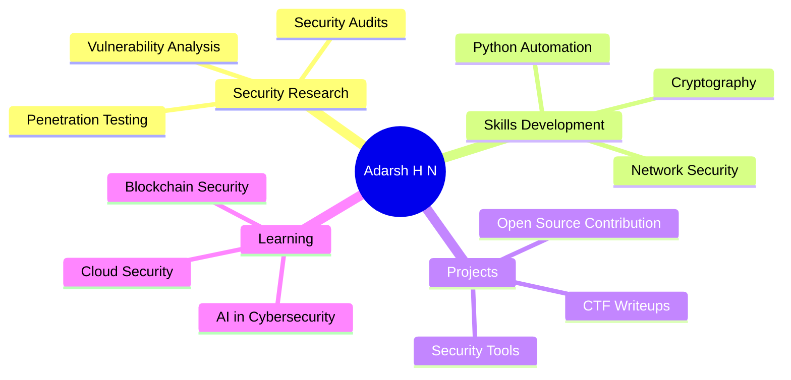

<div align="center">


### 🎓 Cybersecurity Student | NMAMIT, Nitte | Class of 2028

[](https://github.com/ADARSH-HN?tab=followers)
[](https://github.com/ADARSH-HN)

</div>

---


## 🛡️ About Me

```python
class CyberSecurityEnthusiast:
    def __init__(self):
        self.name = "Adarsh H N"
        self.role = "Security Researcher"
        self.education = "CS (Cybersecurity) @ NMAMIT"
        self.graduation = 2028
        self.interests = [
            "Ethical Hacking",
            "Penetration Testing", 
            "Malware Analysis",
            "Network Security",
            "CTF Challenges"
        ]
    
    def current_focus(self):
        return "Building secure systems 🔒"
    
    def get_motto(self):
        return "Hack the Planet, Protect the Future 🌐"
```

<br clear="right"/>

---

## 🔧 Tech Arsenal

<div align="center">

### 💻 Languages & Frameworks


### 🔐 Security Tools


### 🛠️ Development Tools


</div>

---

## 📊 GitHub Analytics

<div align="center">


</div>

---

## 🏆 GitHub Trophies

<div align="center">

[](https://github.com/ryo-ma/github-profile-trophy)

</div>

---

## 🎯 Current Focus

<div align="center">



</div>

---

## 🌐 Connect With Me

<div align="center">

[](https://linkedin.com/in/adarsh-hn)
[](mailto:adarshnaik7338@gmail.com)

</div>

---

## 💭 Quote of the Day

<div align="center">


</div>

---

<div align="center">

### 🔒 "In Code We Trust, In Security We Must" 🔒


### ⚡ Powered by Passion | Secured by Knowledge | Driven by Curiosity ⚡


---

**"The only truly secure system is one that is powered off, cast in a block of concrete and sealed in a lead-lined room with armed guards."**  
*- Gene Spafford*


</div>
